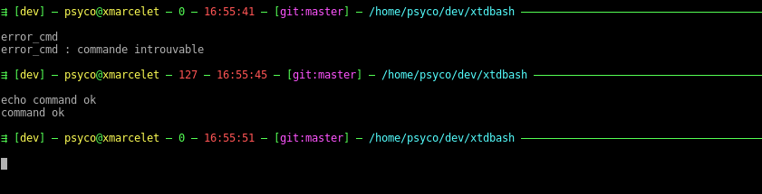

<!-- markdown-toc start - Don't edit this section. Run M-x markdown-toc-refresh-toc -->
**Table of Contents**

- [Quick start](#quick-start)
- [Modules](#modules)
- [API reference](#api-reference)
    - [envloader](#envloader)
    - [promptcmd](#promptcmd)
    - [historysync](#historysync)
    - [lastdir](#lastdir)
    - [cdevent](#cdevent)
    - [tools](#tools)

<!-- markdown-toc end -->

# Quick start

1. Clone XtdBash

```bash
cd <install-directory-root>
git clone https://github.com/psycofdj/xtdbash.git
```

2. Append the following to your bashrc:

```bash
. <install-directory-root>/xtdbash/xtdbash

# initialize xtdbash with desired modules
xtdbash_init \
  aliases \
  promptcmd \
  envloader \
  historysync \
  lastdir

# sources any file found in ~/.bashrc.*
xtdbash_externals

# (optional) activates git branch in prompt line
promptcmd_enable_git

# (optional) adds git branch label to prompt line
promptcmd_enable_prompt
```

**Note**: Every module is optional but some require others.

# Modules

- [envloader](#envloader)     : load environment variables from json file
- [promptcmd](#promptcmd)     : configure your prompt line and runs commands
- [historysync](#historysync) : configure bash command history
- [lastdir](#lastdir)         : remember your last current directory and restore it on new shell
- [cdevent](#cdevent)         : manages commands to run when changing directory
- [tools](#tools)             : various helper functions
- [aliases](#aliases)         : define standard aliases

# API reference

Main functions are loaded through ```xtdbash``` script.

- ```xtdbash_verbose_on(scope)```: enable verbose output, if **scope** is *all*, affects all modules
- ```xtdbash_verbose_off(scope)```: disable verbose output, if **scope** is *all*, affects all modules
- ```xtdbash_init(name...)```: load modules given as arguments handling their dependencies
- ```xtdbash_externals```: loads additional bash configuration files found in ```~/.bashrc.*```


See [quick start](#quick-start) section for an example.


## envloader

**requires**: [cdevent](#cdevent) and [jq (external dep)](https://stedolan.github.io/jq/)

This module exports environment variables found in json files ```.env.json``` from
current directory to root filesystem.

When a variable is set by multiple files, it gets its value from the closest ```.env.json```

For security reason, ```.env.json``` files **must not** be writable by other. If so, file
will be ignored and a warning is emitted.


- ```envloader_verbose_on()```:  enable verbose output for the module
- ```envloader_verbose_off()```: disable verbose output for the module
- ```envloader_list()```: list all variables managed by envloader with their origin file
- ```envloader_unload()```: unset all variables managed by envloader
- ```envloader_run()```: search for ```.env.json``` files and set environment variables

**Example**

```bash
# we declare variables for parent directory
echo '{ "MYVAR1" : "1", "MYVAR2" : "2" }' > ../.env.json

# we declare variables for current directory
echo '{ "MYVAR3" : "2", "MYVAR1" : "overriden" }' > .env.json

# we trigger envloader by 'changing' current directory
cd .

# display result
# Note: MYVAR1 is multiply defined. Its gets its value from closest .env.json file
env | grep MYVAR | sort
MYVAR1=overriden
MYVAR2=2
MYVAR3=3

# same with envloader_list
envloader_list
-> MYVAR1 = override (<dir>/.env.json)
-> MYVAR2 = 2 (<parent-dir>/.env.json)
-> MYVAR3 = 3 (<dir>/.env.json)
```

**Pro tips** : working with dynamic PATH

At startup, envloader stores ```${PATH}``` in the variable ```${BASE_PATH}```. Because
json content is bash-interpreted, you may declare the following ```.env.json``` file:
```json
{
  "GOPATH": "/home/user/dev/go",
  "PATH": "${BASH_PATH}:${GOPATH}/bin"
}
```

**Pro tips** : using complex variable values

This module also works with objects and array values.
```json
{
  "GOPATH"     : "/home/user/go",
  "DOCKER_ENV" : {
    "name"   : "my-container",
    "export" : "/mnt/data",
    "ports"  : [80, 443]
  }
}
```

```bash
envloader_list

->     GOPATH = /home/user/go (<path>/.env.json)
-> DOCKER_ENV = {"name":"my-container","export":"/mnt/data","ports":[80,443]} (<path>/.env.json)
```


## promptcmd

**requires**: none

This module manages commands that must be run between each prompt display.


- ```promptcmd_push(cmd)```: adds **cmd** to the list of commands to run on each prompt display

- ```promptcmd_run```: run all registered prompt commands

- ```promptcmd_enable_prompt```: register a command that replace default PS1 format
  by colored full-line prompt. This prompt displays:
  - type of environment (dev, rec or prod). This is deduced from hostname string.
  - current login name
  - current host name
  - last command exit code (blinking red when non-zero)
  - current time
  - current directory
  - additional labels given by ```PROMPTCMD_LABELS``` environment variable


  ```PROMPTCMD_LABELS``` environment variable contains a semi-column delimited list of **items**,
  where each items matches one of the following formats:
  - ```text``` : display **text** as label with default color **lightmagenta**
  - ```text|color``` : display **text** as label with given **color**

    Valid color names are: *black*, *red*, *green*, *yellow*, *blue*, *magenta*, *cyan*, *white*,
    *lightblack*, *lightred*, *lightgreen*, *lightyellow*, *lightblue*, *lightmagenta*, *lightcyan*,
    *lightwhite*

  **Note**: ```PROMPTCMD_LABELS``` is reset between each prompt. Variable should be set
  by pushing a function with ```promptcmd_push(cmd)```.

  

- ```promptcmd_enable_git```: populates ```PROMPTCMD_LABELS``` with current git branch name.
  Selected color depends on current working tree status :
  - **green**  : all modifications are committed, no untracked files
  - **yellow** : all modifications are committed, some untracked files
  - **red** : some uncommitted changes


## historysync

**requires**: [promptcmd](#promptcmd)

Synchronize command history between bash instances.


- ```historysync_off```: Disable history synchronization for this instance

- ```historysync_on```: Enable history synchronization for this instance. Synchronization is **on**
  by default.

- ```historysync_run```: run history synchronization for current bash instance. This function is
  automatically added to [promptcmd](#promptcmd).


## lastdir

**requires**: [cdevent](#cdevent)

Remember last working directory and use it for future new bash sessions.
There is no api for this module, everything work by pushing special commands to
[cdevent](#cdevent) module.


## cdevent

**requires**: [tools](#tools)

Manage a list of commands to run when changing directory. This works by decorating
the builtin command ```cd``` by an internal function.


- ```cdevent_push(cmd)```: adds **cmd** to the command list to run when changing directory.


## tools

**requires**: none

Provides a list of help functions.

- ```decorate_builtin(builtin pre post)```: decorates the builtin function **builtin** with
  **pre** that runs before the builtin and **post** that runs after the builtin


- ```decorate_function(fn pre post)```: decorates the function **fn** with
  **pre** that runs before the function and **post** that runs after the function

<!-- Local Variables: -->
<!-- ispell-local-dictionary: "american" -->
<!-- End: -->
